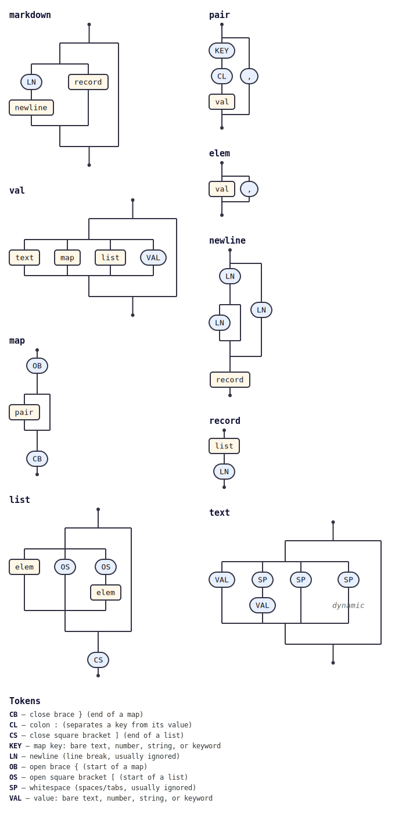

# @tabnas/markdown

This plugin allows the [Tabnas](https://jsonic.senecajs.org) JSON parser to support markdown syntax.

This repository contains:

| Path | Description |
|---|---|
| [`ts/`](ts/) | TypeScript / JavaScript implementation. |
| [`go/`](go/) | Go port. |
| [`test/fixtures/`](test/fixtures/) | Shared conformance fixtures, exercised by both runtimes. |

See [`ts/README.md`](ts/README.md) for usage.

## Grammar diagram

The grammar as a railroad/syntax diagram, generated from the live grammar
with [`@tabnas/railroad`](https://github.com/tabnas/railroad):

ASCII version: [`ts/doc/grammar.txt`](ts/doc/grammar.txt).

## License

MIT. Copyright (c) Richard Rodger.
