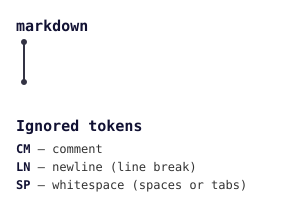

# @tabnas/markdown

<!-- tabnas-badges -->
[](https://www.npmjs.com/package/@tabnas/markdown)
[](https://github.com/tabnas/markdown/actions/workflows/ci.yml)
[](https://pkg.go.dev/github.com/tabnas/markdown/go)
[](https://tabnas.github.io/status/)
<!-- /tabnas-badges -->

A [Tabnas](https://github.com/tabnas/parser) grammar plugin that parses **CommonMark / GFM Markdown** into a JSON AST — headings, paragraphs, blockquotes, lists, code blocks, thematic breaks, HTML, and inline (emphasis, strong, code, links, images, strikethrough). Available for both **TypeScript** and **Go**, built on the bare `@tabnas/parser` engine.

> **Rescope note:** this package was previously a CSV-family record parser (copied from `@tabnas/csv`). As of this release it parses prose Markdown; record parsing is available via `@tabnas/csv` (see `dx-report.md`).

```bash
# TypeScript
npm install @tabnas/markdown @tabnas/parser

# Go
go get github.com/tabnas/markdown/go@latest
```

## One tiny example

**TypeScript**

```js
import { Tabnas } from '@tabnas/parser'
import { Markdown } from '@tabnas/markdown'

const j = new Tabnas().use(Markdown)

j.parse('# Hello\n\nHello *world*') // => { type: 'document', children: [{ type: 'heading', depth: 1, children: [{ type: 'text', value: 'Hello' }] }, { type: 'paragraph', children: [{ type: 'text', value: 'Hello ' }, { type: 'emphasis', children: [{ type: 'text', value: 'world' }] }] }] }
j.parse('# Hello') // => { type: 'document', children: [{ type: 'heading', depth: 1, children: [{ type: 'text', value: 'Hello' }] }] }
```

**Go**

```go
j := tabnasmarkdown.Make() // or jsonic.Make().Use(markdown.Markdown, ...)
result, _ := j.Parse("# Hello\n\nHello *world*")
fmt.Println(result) // map[type:document children:[...]]
```

## What is parsed

Blocks: ATX headings (`#`…`######`), Setext headings (`===`/`---`), paragraphs, thematic breaks (`---`, `***`, `___`), fenced code (```` ``` ```` / `~~~` with info string), indented code (4 spaces), blockquotes (`>`), ordered/unordered lists (`-` `*` `+` / `1.` `1)` with nesting), HTML blocks.

Inline (inside headings, paragraphs, list items): escapes (`\*`), code spans (`` ` ``), emphasis (`*` / `_`), strong (`**` / `__`), links `[text](url "title")`, images ``, autolinks `<https://example.com>`, breaks, GFM strikethrough (`~~text~~` when `gfm:true`).

Output is a single `document` node with `children: Block[]`. Each inline container produces an `Inline[]` AST. See [reference](ts/doc/reference.md) for the full shape.

## Documentation

Documentation follows the [Diátaxis](https://diataxis.fr) framework — one file per quadrant, per language.

| | TypeScript | Go |
|---|---|---|
| Tutorial (learn) | [ts/doc/tutorial.md](ts/doc/tutorial.md) | [go/doc/tutorial.md](go/doc/tutorial.md) |
| How-to (recipes) | [ts/doc/guide.md](ts/doc/guide.md) | [go/doc/guide.md](go/doc/guide.md) |
| Reference (API + options + grammar) | [ts/doc/reference.md](ts/doc/reference.md) | [go/doc/reference.md](go/doc/reference.md) |
| Concepts (how it works) | [ts/doc/concepts.md](ts/doc/concepts.md) | [go/doc/concepts.md](go/doc/concepts.md) |

Per-language hubs: [ts/README.md](ts/README.md) · [go/README.md](go/README.md).

## Grammar diagram

The live grammar as a railroad/syntax diagram, generated from the embedded grammar with [`@tabnas/railroad`](https://github.com/tabnas/railroad):



A vertical ASCII version is in [`ts/doc/grammar.txt`](ts/doc/grammar.txt). The grammar source is the top-level
[`markdown-grammar.jsonic`](markdown-grammar.jsonic), embedded into both implementations by [`ts/embed-grammar.js`](ts/embed-grammar.js) during `npm run build` — edit the grammar file, then re-embed; never edit the embedded copies directly. See `dx-report.md` §2.1 for why the prose grammar is a single `markdown` rule whose block scanner lives in JS.

## Repository layout

| Path | Description |
|---|---|
| [`ts/`](ts/) | TypeScript / JavaScript implementation (canonical). |
| [`go/`](go/) | Go port. |
| [`test/spec/`](test/spec/) | Shared AST fixtures, run by both runtimes. |
| [`test/commonmark/`](test/commonmark/) | Vendored CommonMark 0.31.2 spec suite (652 examples). |

## License

MIT. Copyright (c) Richard Rodger and other contributors.
